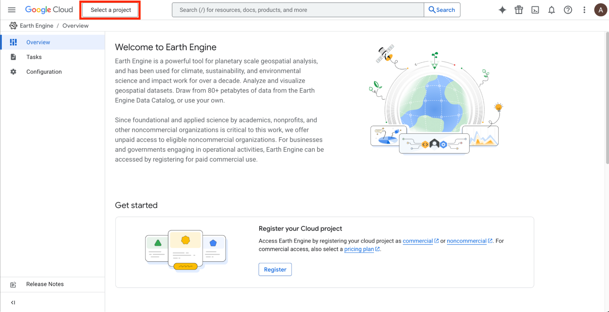
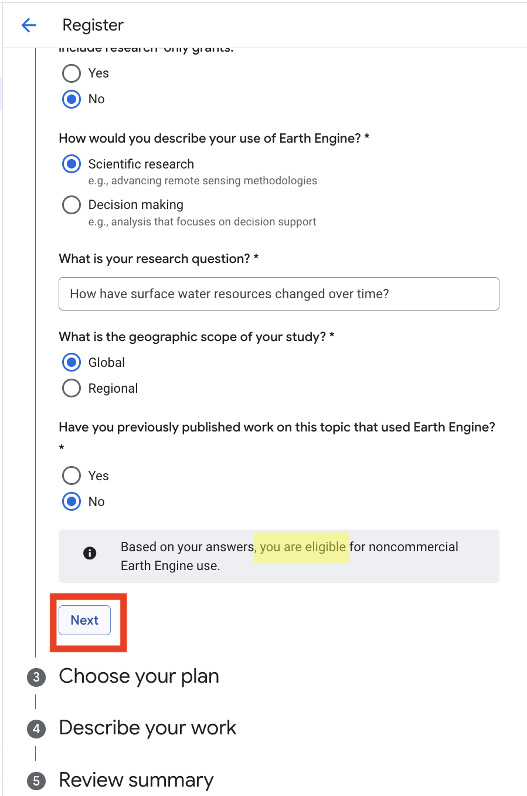

# Get started with the Google Earth Engine Python API

## *To start, make sure you are logged in to your Google account.*

# Step 1: Create a Google Cloud project

1. Visit [**https://console.cloud.google.com/earth-engine**](https://console.cloud.google.com/earth-engine)  
   If prompted, select your country and **agree** to the terms of service.  
     
2. Click on “**Select a Project**”



3. Click on “**New project**”’


4. Enter a **project name** (this can be whatever you want), and select “**No organization**”. Note your ***project ID***, which may be slightly different from the project name. You’ll need this later to authenticate.

5. Click “**Create**”


# Step 2: Enable Google Earth Engine API for your cloud project

6. After creating your project, click on “**Select Project**” under Notifications. This will show the dashboard for the Google Cloud project you just created. This will take you to [**console.cloud.google.com/home/dashboard**](http://console.cloud.google.com/home/dashboard)


7. In the search bar at the top of the screen, type in “google earth engine” and select “**Google Earth Engine API**” in the search results.


8. Click the “**Enable**” button.


# Step 3: Register your Google Cloud project as non-commercial

9. Return to [**https://console.cloud.google.com/earth-engine**](https://console.cloud.google.com/earth-engine)  
     
10. Under “Register your Cloud project”, click the “**Register**” button.  
    


11. Under “See if you are eligible for noncommercial use”, click “**Get started**”.  
    


12. Under “1: Select your organization type”, choose “**Public or private academic institution**”

13. Click **Next**


14. Under “2: Check noncommercial eligibility”, make the selections in the following screenshot. (If you are affiliated with the University of Dar es Salaam or another academic institution, you may list that instead of University of California Irvine.) Make the selections in the following screenshot. 


15. Click the “**Check eligibility**” button  
      
      
16. A grey box indicating that you are eligible for noncommercial use should show up. Click **Next**. 



17. Under “3: Choose your plan”, click **Next**


18. Under “4: Describe your work”, select **Freshwater**.  
      
19. Click **Next**  
    


20. Click the blue “**Register**” button. 

  


# Step 4: Open a Colab notebook and authenticate with your Google Cloud project ID

21. Visit [**https://colab.research.google.com/**](https://colab.research.google.com/) and click **+ new notebook**  
    


22. Paste the following text in the notebook cell, replacing PROJECT_ID with the project ID from your Google Cloud project (making sure it is enclosed in 'quotation marks'):

```
import ee
ee.Authenticate() 
ee.Initialize(project='PROJECT_ID')
```

23. Click the **run button** (triangle in a circle) on the left side of the notebook cell


24. Click through the prompts requesting access to your google account (allow all)


25. You’re ready to start using Google Earth Engine! Click **+ Code** to add a new notebook cell.


26. Paste the following code into a code cell to verify that the **ee** module is working as expected. If running the cell produces no errors, you are all set!

```
image = ee.Image("NASA/ASTER_GED/AG100_003")
print("success!")
```
